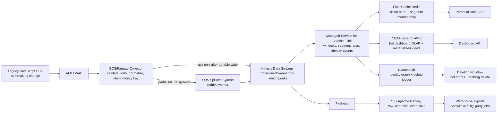

# Engineer 004 Submission — Real-Time Analytics Pipeline

**Candidate:** Oluwagbotemi Elijah Ogundipe  
**Challenge:** Engineer 004 — System Design: Real-Time Analytics Pipeline  
**Core decision:** Use an AWS-native streaming pipeline around **Kinesis Data Streams + Managed Service for Apache Flink + ClickHouse on AWS + S3/Iceberg**, not MSK/Kafka as the first move.

## 0. Executive judgment

The brief describes a 50M events/day analytics system with **15–30 minute latency**, **~3% event loss at peak**, a **$50K/month infrastructure ceiling**, **500+ tenants**, and an MVP target in **3 months**. Those are **brief-observed** numbers.  

My design optimizes for: **durable ingest first, measurable accuracy second, real-time activation third**. It deliberately avoids starting with self-managed Kafka/MSK unless Kinesis proves insufficient. At **50M events/day**, the hard problem is not raw scale; it is correctness under tenant skew, safe migration, idempotency, GDPR deletion, and proving that the new pipeline matches the old system before cutover.

**Target MVP result:**  
- **<5s dashboard freshness** for live aggregates and segment membership.  
- **No acknowledged event lost after collector acceptance.** Browser-side loss cannot be fully solved without a future SDK retry/Beacon update.  
- **Dual-run validation** until discrepancy is below a defined threshold for priority tenants.  
- **Rollback by tenant feature flag**, not a global cutover.

## 1. Architecture



### Why Kinesis first, not MSK first

For a **2-senior-engineer** dedicated team and an AWS-only constraint, Kinesis reduces operational surface area. Kafka/MSK is reasonable later if the company needs Kafka ecosystem portability, long retention, or custom consumer patterns. For this brief, the measurable requirement is **<5s visibility and no accepted-event loss**, not Kafka ownership.

Kinesis risk is **partition-key skew and sudden jumps beyond warmed capacity**. I handle that with:
- partition key: `tenant_id + ":" + hash(visitor_id) % N`, not only `tenant_id`;
- per-tenant write quotas and burst buckets;
- launch-calendar prewarming/provisioned shards before Black Friday or major customer launches;
- SQS spillover for write failures after bounded retries.

## 2. Event contract and identity model

### Canonical event

```json
{
  "event_id": "v7_uuid_or_collector_hash",
  "tenant_id": "t_123",
  "anonymous_id": "a_abc",
  "user_id": "u_456_or_null",
  "session_id": "s_789",
  "event_type": "page_view|click|form_submit|custom",
  "event_name": "pricing_viewed",
  "properties": {},
  "context": {
    "url": "/pricing",
    "user_agent_hash": "sha256:...",
    "ip_prefix_hash": "sha256:..."
  },
  "client_ts": "2026-05-14T09:00:00Z",
  "received_ts": "2026-05-14T09:00:00.230Z",
  "schema_version": 1
}
```

**Idempotency:** If the SDK already sends an ID, preserve it. If not, the collector generates a deterministic hash from tenant, anonymous ID, session, event name, client timestamp, URL, and a short property digest. This will not be perfect for repeated identical clicks, so the dedupe window is short and configurable.

**Identity stitching:**  
- Flink treats login/identify events as edges between `anonymous_id` and `user_id`.  
- DynamoDB stores canonical identity mappings and a deletion ledger.  
- Redis stores the hot visitor profile for personalization.  
- Batch reconciliation from Iceberg corrects late or conflicting identity edges.

**Data minimization:** Raw IP and raw user agent should not be stored. Keep hashed/coarsened values unless a customer contract explicitly requires something else.

## 3. Scale model and capacity

The attached artifact `load_and_cost_model.py` computes the sizing model.

Key calculations:
- **[Brief-observed]** 50,000,000 events/day.
- **[Estimated]** Average rate = `50,000,000 / 86,400 = 579 events/sec`.
- **[Estimated]** 10x spike = `5,787 events/sec`.
- **[Assumed]** Average event payload = `1.5 KB`.
- **[Estimated]** Average ingest = `0.87 MB/sec`; 10x spike = `8.68 MB/sec`.
- **[Benchmarked]** Kinesis provisioned shard write capacity is `1,000 records/sec` or `1 MB/sec`.
- **[Estimated]** Spike requires `max(ceil(5,787/1,000), ceil(8.68/1)) = 9 shards`; I would provision **15 shards** for launch windows to give headroom for tenant skew and retries.
- **[Benchmarked]** ClickHouse recommends batch inserts of at least `1,000` rows and ideally `10,000–100,000` rows.
- **[Estimated]** At 10x spike, a `5s` flush gives about `28,935` rows/batch; at average traffic, either use async inserts or aggregate per partition before inserting.

### Why the load number matters

The current system is probably not failing because 50M/day is “huge.” It is failing because of one or more of:
1. the old system acknowledges before durable write;
2. tenant hot spots overload a partition or worker;
3. batch jobs create latency and backlog;
4. dashboard reads hit transactional storage;
5. no reconciliation loop exists to detect loss.

## 4. Storage paths

### A. Raw/canonical event lake — S3 + Apache Iceberg

Every accepted event lands in an Iceberg table partitioned by `event_date`, `tenant_bucket`, and optionally `event_type`. This is the source of truth for backfill, audits, warehouse export, and deletion workflows.

Iceberg is important because GDPR/CCPA deletion cannot be a hand-wavy “delete later” process. The deletion workflow must:
1. write a deletion request to DynamoDB;
2. remove profile/session keys from Redis;
3. delete/update rows in ClickHouse by tenant/user;
4. issue Iceberg deletes in the event lake;
5. export a deletion completion record.

### B. Hot dashboard store — ClickHouse on AWS

ClickHouse stores recent queryable events and materialized aggregate tables. I would keep the first version boring:
- replicated 3-node ClickHouse cluster on EC2/EBS or managed ClickHouse running in AWS if procurement allows it;
- 30-day hot retention for event-level dashboard queries;
- materialized views for common time-series dashboard cards;
- S3/Iceberg is still the source of truth, so ClickHouse can be rebuilt.

### C. Real-time state — Redis + DynamoDB

- Redis: visitor state, active segments, “viewed pricing 3x in last 7 days,” recent behavior flags. This is activation state, not the permanent record.
- DynamoDB: identity graph, deletion ledger, tenant config, schema/version registry cache.

## 5. Reliability model

### Ingest rule

The collector should only return success after the event is durably accepted by Kinesis or by the SQS spillover path. If both fail, return a non-2xx response. That does not guarantee the browser retries, but it prevents the company from claiming success for events it never persisted.

### Failure handling

| Failure | Detection | Handling |
|---|---|---|
| Hot tenant overwhelms shard | Kinesis throttles by partition key, tenant write rate anomaly | Tenant hash bucketing, per-tenant quotas, pre-sharding/warming |
| Kinesis partial PutRecords failure | Collector write result | Retry with backoff; spill failed records to SQS |
| Flink lag | Iterator age, watermark lag, checkpoint duration | Autoscale KPUs, degrade dashboard freshness banner, replay from Kinesis/S3 |
| ClickHouse insert pressure | parts count, merge backlog, insert latency | batch/async inserts, materialized view isolation, pause low-priority queries |
| Identity conflicts | duplicate mappings, late login events | deterministic merge rules + nightly reconciliation |
| GDPR deletion misses a store | deletion ledger stuck state | deletion state machine with retries and audit proof |
| Dashboard numbers differ from old system | parity report | block tenant cutover until root cause is classified |

## 6. Migration plan

### Month 1 — durable shadow

- Add collector compatibility layer behind existing endpoint.
- Write to Kinesis + S3/Iceberg while keeping the old system untouched.
- Build schema validation and DLQ review.
- Produce daily parity reports: event count, tenant count, event-type count, sampled payload comparison.

### Month 2 — real-time read path

- Add Flink jobs for rolling aggregates and segment membership.
- Build ClickHouse materialized views for the first dashboard cards.
- Add Redis visitor state for personalization reads.
- Enable internal dashboards and 5–10 friendly customers in shadow mode.

### Month 3 — tenant-by-tenant cutover

- Enable new dashboard reads for selected tenants.
- Keep old pipeline as fallback.
- Roll forward by tenant cohort, not globally.
- Rollback: feature flag routes read path back to old dashboard while new ingest continues shadowing.

## 7. Validation plan

The attached `test_plan.md` is the operating checklist. The core validation jobs are:

1. **Count parity:** old vs new by tenant, event type, and 5-minute bucket.  
2. **Replay test:** replay one day from Iceberg into a staging ClickHouse and compare aggregates.  
3. **Spike test:** generate 10x traffic using tenant-skew scenarios, not uniform traffic only.  
4. **Loss test:** kill collectors, throttle Kinesis, pause ClickHouse, and confirm accepted events are replayable.  
5. **Deletion test:** create a synthetic user, emit events, request deletion, and verify absence from Redis, ClickHouse, and Iceberg query results.  
6. **Human review:** inspect sampled transformed events for semantic correctness; AI should not approve schema changes alone.

## 8. Tradeoffs

| Choice | I gain | I sacrifice |
|---|---|---|
| Kinesis over MSK first | Less ops for 2 engineers, AWS-native scaling | Less Kafka ecosystem flexibility |
| ClickHouse for dashboard OLAP | Fast analytical queries and materialized views | More operational work than fully serverless Athena |
| Redis for activation state | Low-latency personalization | Must rebuild from event source if lost |
| Iceberg source of truth | Deletion/upsert/replay story | More table maintenance and compaction work |
| Tenant-by-tenant rollout | Safe migration | Slower full cutover |

## 9. What breaks this plan

- A single tenant sends a large fraction of all traffic and the partition key is not bucketing correctly.
- The current SDK does not retry failed sends, so pre-collector network/browser loss remains unsolved.
- “Zero data loss” is interpreted as exactly-once customer-visible analytics. The practical target is **at-least-once ingest + idempotent processing + reconciliation**.
- Compliance requirements demand hard deletion from all backups immediately; that changes backup retention and legal process.
- Dashboard users expect arbitrary historical ad-hoc queries under 5s. That is a separate product requirement and needs a pre-aggregation/query-budget design.
- Warehouse export is required to be real time; I treat exports as async unless contractually required.

## 10. What stays human

- Approving schema changes that alter customer-visible metrics.
- Deciding whether a discrepancy is acceptable for tenant cutover.
- GDPR/CCPA exception handling and legal-retention policy decisions.
- Changing per-tenant rate limits for strategic customers.
- Communicating dashboard freshness degradation to customers.
- Choosing whether to prioritize cost reduction or reliability after MVP.

## 11. Evidence log

| Claim | Label | Proof tier | Evidence |
|---|---:|---:|---|
| Challenge requires 50M events/day, <5s visibility, 10x spikes, $50K/month ceiling | Brief-observed | 3 | Challenge brief |
| Average rate is 579 events/sec | Estimated | 3 | `load_and_cost_model.py` formula |
| 10x spike is 5,787 events/sec | Estimated | 3 | `load_and_cost_model.py` formula |
| 1.5KB payload assumption creates 8.68MB/sec spike | Assumed + Estimated | 3 | Script parameter + output |
| Kinesis shard supports 1,000 records/sec or 1MB/sec write | Benchmarked | 3 | AWS Kinesis docs |
| Kinesis on-demand default capacity can be lower than this spike | Benchmarked + Estimated | 3 | AWS Kinesis docs + script |
| ClickHouse batching should avoid tiny inserts | Benchmarked | 3 | ClickHouse docs |
| GDPR deletion should use a deletion ledger and queryable delete-capable table format | Benchmarked + Judgment | 2 | AWS Athena/Iceberg docs + design |
| This architecture stays below $50K/month | Estimated | 2 | Cost guardrail model; final pricing must be checked in AWS Pricing Calculator |

## 12. AI usage disclosure

I used AI for:
- extracting the challenge constraints;
- checking public AWS and ClickHouse documentation;
- drafting the first design structure;
- generating a sizing script and submission package.

I personally changed/checked:
- the core architecture choice: Kinesis first, not Kafka first;
- the load math and source labels;
- the failure modes around SDK-side loss and tenant skew;
- the compliance path using a deletion ledger and Iceberg deletes;
- the migration approach so it does not break existing integrations.

Known weak spots:
- Cost numbers are estimates, not a final AWS quote.
- Payload size is assumed because the brief does not provide real event samples.
- Exact ClickHouse sizing requires a real query workload and cardinality profile.


---

# Appendix: Artifact Summary

# Single Grain Engineer 004 Submission Package

This package contains:

1. `challenge_submission.md` — the written submission.
2. `architecture.mmd` — Mermaid architecture diagram.
3. `load_and_cost_model.py` — runnable sizing model for event rate, spike load, Kinesis shard sizing, S3 raw volume, and budget guardrails.
4. `model_output.json` — output from the sizing model with default assumptions.
5. `test_plan.md` — operating checklist for migration, reliability, accuracy, and deletion validation.
6. `evidence_log.md` — proof tier and source-label table.

## How to run the artifact

```bash
python3 load_and_cost_model.py
python3 load_and_cost_model.py --events-per-day 50000000 --avg-event-kb 1.5 --spike-multiplier 10
```

## What the reviewer should inspect

- The design does not hide behind generic “Kafka + Flink” wording.
- The sizing model shows why 50M/day is modest but 10x sudden spike + tenant skew can still break ingest.
- The failure plan is explicit about what cannot be guaranteed without SDK changes.
- The compliance design includes deletion workflow, not just storage.


## Model Output

```json
{
  "generated_at": "2026-05-14T09:48:15.904267+00:00",
  "inputs": {
    "events_per_day": {
      "value": 50000000,
      "label": "brief-observed"
    },
    "avg_event_kb": {
      "value": 1.5,
      "label": "assumed"
    },
    "spike_multiplier": {
      "value": 10,
      "label": "brief-observed"
    },
    "month_days": {
      "value": 30,
      "label": "assumed"
    }
  },
  "derived_load": {
    "avg_events_per_second": {
      "value": 578.7,
      "label": "estimated"
    },
    "spike_events_per_second": {
      "value": 5787.04,
      "label": "estimated"
    },
    "avg_ingest_mb_per_second": {
      "value": 0.85,
      "label": "estimated"
    },
    "spike_ingest_mb_per_second": {
      "value": 8.48,
      "label": "estimated"
    },
    "monthly_raw_gb": {
      "value": 2145.77,
      "label": "estimated"
    }
  },
  "kinesis_sizing": {
    "records_per_sec_per_shard": {
      "value": 1000,
      "label": "benchmarked"
    },
    "mb_per_sec_per_shard": {
      "value": 1,
      "label": "benchmarked"
    },
    "shards_needed_by_records": {
      "value": 6,
      "label": "estimated"
    },
    "shards_needed_by_mb": {
      "value": 9,
      "label": "estimated"
    },
    "minimum_spike_shards": {
      "value": 9,
      "label": "estimated"
    },
    "recommended_launch_window_shards": {
      "value": 14,
      "label": "estimated"
    },
    "on_demand_default_records_per_second": {
      "value": 4000,
      "label": "benchmarked"
    },
    "on_demand_default_mb_per_second": {
      "value": 4,
      "label": "benchmarked"
    },
    "on_demand_default_is_enough_for_10x": {
      "value": false,
      "label": "estimated"
    }
  },
  "clickhouse_insert_guardrail": {
    "target_batch_rows": {
      "value": 10000,
      "label": "benchmarked"
    },
    "seconds_to_10k_rows_at_avg": {
      "value": 17.28,
      "label": "estimated"
    },
    "rows_per_5s_at_spike": {
      "value": 28935.0,
      "label": "estimated"
    },
    "note": "Use async inserts or buffering when average traffic produces small per-partition batches."
  },
  "budget_guardrail": {
    "challenge_monthly_ceiling_usd": {
      "value": 50000,
      "label": "brief-observed"
    },
    "estimated_monthly_cost_low_usd": {
      "value": 12000,
      "label": "estimated"
    },
    "estimated_monthly_cost_high_usd": {
      "value": 28000,
      "label": "estimated"
    },
    "requires_aws_pricing_calculator_before_commit": true
  }
}

```
